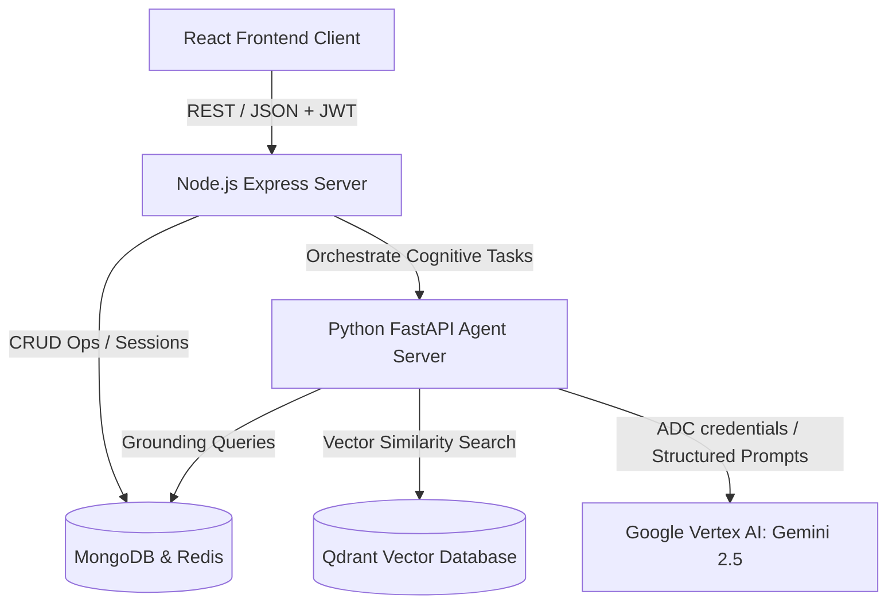
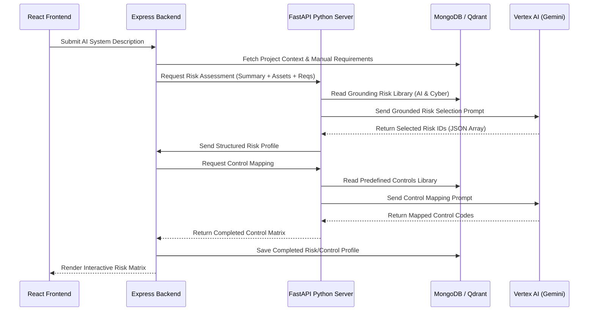
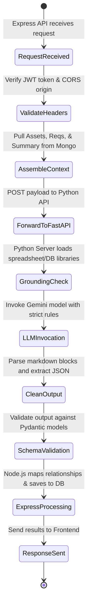
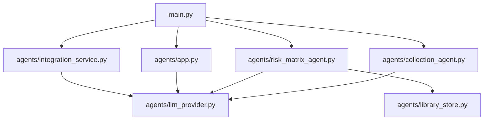
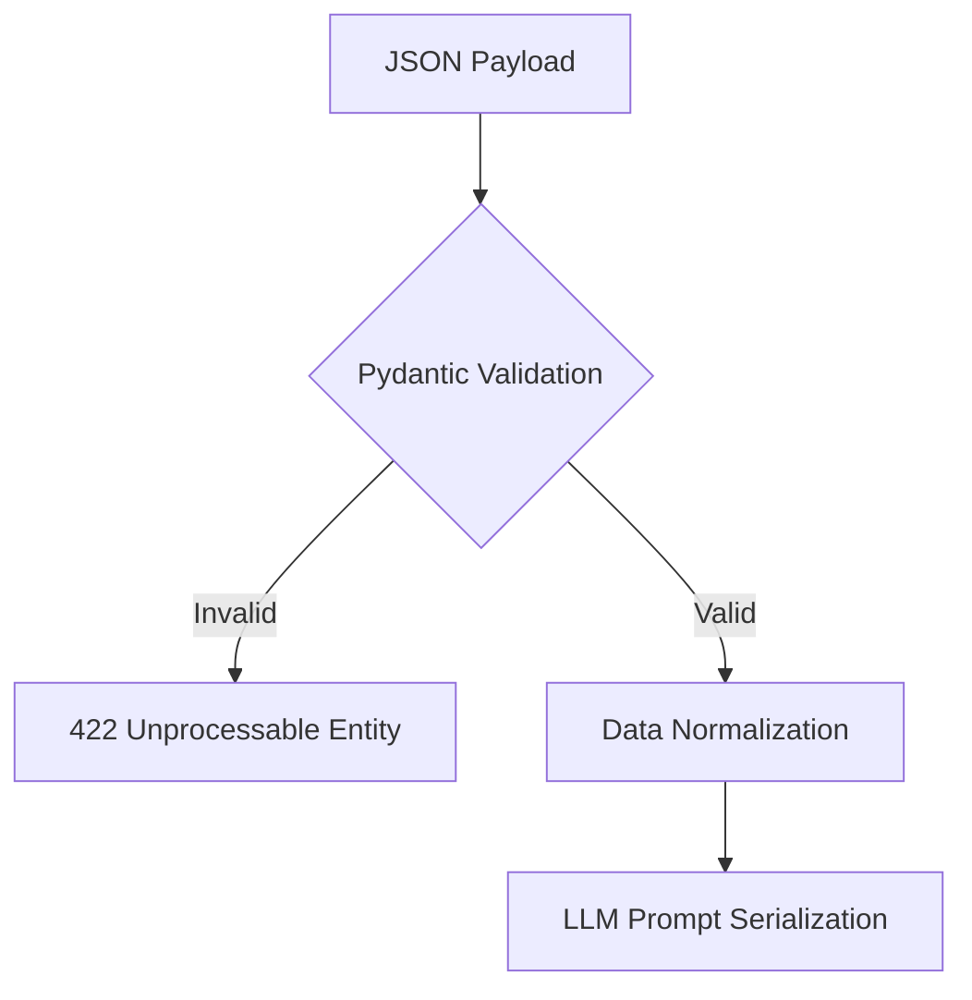
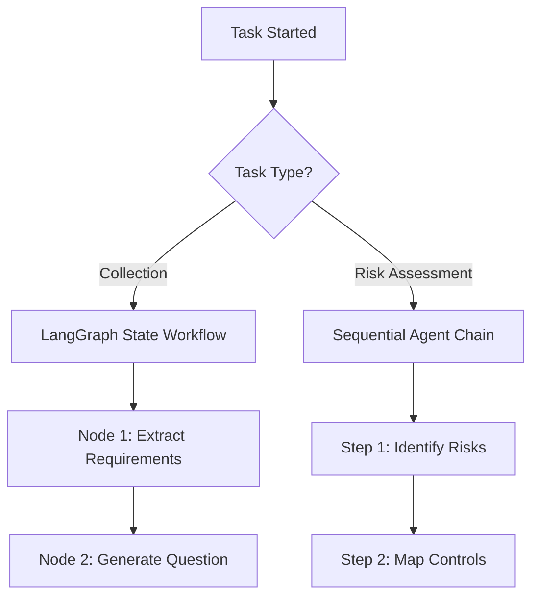
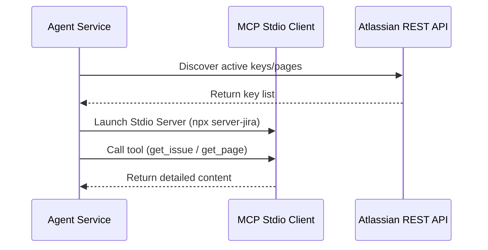

# 🚀 Agent System Deep-Dive Technical Documentation

Welcome to the principal engineering documentation for the **Rakfort AI Governance Platform's Agentic AI System**. This document serves as a complete technical guide, system architecture blueprint, and troubleshooting manual for maintainers, architects, and engineers.

---

## 📌 SECTION 1: High-Level Overview

### 1. The Core Problem & The Role of AI Agents
Enterprise AI development faces a dual challenge: **compliance uncertainty** and **unstructured risk discovery**. Standard software cannot autonomously parse conversational descriptions or raw policy documents to map security requirements, and generic LLMs frequently hallucinate risks or controls. 

The AI Agent system acts as a **constrained reasoning engine** that bridges this gap. It reads system descriptions, requirements, and compliance questionnaires, maps them to official framework boundaries (NIST AI RMF, ISO 42001, EU AI Act), and maps mitigation controls from localized libraries without generating fabricated details.

### 2. Architecture Classification
This system is a **hybrid multi-agent architecture** combining:
1. **Deterministic State-Machines (LangGraph)**: Used for the guided requirement collection chat intake workflow.
2. **Context-Constrained Reasoning Agents (FastAPI + Vertex AI/Gemini)**: Structured agents that extract risks, map security controls, and grade compliance questionnaires.
3. **Retrieval-Augmented Generation (RAG) Engines**: Vector search structures using Qdrant and Local file indices for deep policy analysis.

### 3. Overall Workflow in One Paragraph
When a user describes an AI system, the **Collection Agent** uses a LangGraph state machine to conversationalize the intake, extracting structured security requirements. These requirements and manually logged assets are aggregated by the Node.js backend into a unified system context. The backend sends this context to the **Risk Selection Agent**, which queries a localized database or spreadsheet library to extract relevant risks. This risk list is processed by the **Control Mapping Agent** to associate specific, pre-approved mitigation controls. Finally, the **Governance Assessor Agent** evaluates compliance questionnaire responses against reference corporate policies, scoring control maturity on a 0-4 scale and calculating aggregated compliance percentages.

### 4. Architectural & Lifecycle Diagrams

#### A. Multi-Tier System Architecture


#### B. Component Interaction Sequence


#### C. Request Lifecycle Diagram


---

## 📌 SECTION 2: Repository Structure

### 1. Folder Structure & File Manifest
The AI Agent system resides inside `ai-governance-main/backend/Agents/`.

```
ai-governance-main/backend/Agents/
├── .env                          # Local environment secrets & model configurations (Critical)
├── .gitignore                    # Prevents credentials from leaking to git (Critical)
├── .venv/                        # Python virtual environment containing dependencies (Critical)
├── README.md                     # Base execution instructions (Optional)
├── main.py                       # Core FastAPI application & Excel-based routers (Critical)
├── requirements.txt              # Declares python dependencies (Critical)
├── import_libraries.py           # Seeds MongoDB from spreadsheet libraries (Critical)
├── predefined_risks.xlsx         # Master AI risks spreadsheet (Optional/Grounding)
├── predefined_controls.xlsx      # Master AI controls spreadsheet (Optional/Grounding)
├── stride_risks.xlsx             # Master cybersecurity threats spreadsheet (Optional/Grounding)
├── nist_controls.xlsx            # Master NIST security controls spreadsheet (Optional/Grounding)
├── qdrant_data_api/              # Local storage folder for vector indexes (Critical for RAG)
└── agents/                       # Specialized cognitive agent packages (Critical)
    ├── __init__.py               # Packages agents directory as importable module
    ├── app.py                    # RAG QA engine, GCS file synchronization (Critical)
    ├── collection_agent.py       # Conversational requirements collector (Critical)
    ├── integration_service.py    # MCP Stdio connections for Jira/Confluence (Critical)
    ├── library_store.py          # MongoDB library reader & importer helper (Critical)
    ├── llm_provider.py           # LangChain model builder for Gemini & Vertex (Critical)
    ├── risk_matrix_agent.py      # Main Excel-grounded Risk & Control assessor (Critical)
    ├── utils.py                  # Static string templates & formatting tools (Optional)
    └── waste/                    # Deprecated code assets (Safe to ignore)
```

### 2. Dependency Map & Data Flows



### 3. File-by-File Technical Breakdown

#### `main.py` (Entry Point)
* **Why it exists:** Serves as the primary ASGI application runner. It aggregates all sub-routers, configures CORS middleware, registers startup handlers, and exposes health check endpoints.
* **Callers:** Python's uvicorn server (`uvicorn main:app`) or PM2 process manager (`ecosystem.config.js`).
* **Input Data:** HTTP request payloads mapped to FastAPI Pydantic models.
* **Output Data:** JSON payloads conforming to router outputs.

#### `agents/llm_provider.py`
* **Why it exists:** Abstracted provider pattern. Automatically builds `ChatGoogleGenerativeAI` or VertexAI instances depending on environment variables.
* **Callers:** `collection_agent.py`, `risk_matrix_agent.py`, `app.py`, `integration_service.py`.
* **Input Data:** Model configurations, message parameters.
* **Output Data:** A ready-to-run LangChain LLM object.

#### `agents/library_store.py`
* **Why it exists:** Manages reads and writes to MongoDB collections (`risk_libraries` & `control_libraries`).
* **Callers:** `main.py` (during seeds), `risk_matrix_agent.py` (when mapping risks).
* **Input Data:** Normalization payloads, query filters.
* **Output Data:** Pandas DataFrames loaded from MongoDB or Excel fallbacks.

#### `agents/collection_agent.py`
* **Why it exists:** Implements the conversational agent using LangGraph state machine. Extracts technical requirements from text transcripts or PDF uploads.
* **Callers:** Express backend endpoint (`/requirements/collect`).
* **Input Data:** `session_id`, transcript message lists.
* **Output Data:** Structured JSON listing extracted requirements and a followup question.

#### `agents/risk_matrix_agent.py`
* **Why it exists:** Houses the core Excel-grounded risk generation and control association logic.
* **Callers:** Express backend endpoint (`/questionnaires/assess`).
* **Input Data:** System summaries, project IDs.
* **Output Data:** A structured control matrix and risk profile.

#### `agents/app.py`
* **Why it exists:** Runs the RAG (Retrieval-Augmented Generation) engine, manages Qdrant local vector spaces, and syncs corporate guidelines from Google Cloud Storage (GCS).
* **Callers:** Express backend endpoint (`/api/documents`).
* **Input Data:** Queries, document binary uploads, GCS sync triggers.
* **Output Data:** Grounded answers, metadata contexts, source paths.

---

## 📌 SECTION 3: Input Flow

### 1. Input Processing Mechanics
Every request targeting the AI agent system follows a strict pipeline: validation ➔ parsing ➔ normalization ➔ transformation.



### 2. Validation & API Contracts
All input models are strictly defined using **Pydantic**.
Let's analyze the contract for the risk assessment request:

```python
class RiskIn(BaseModel):
    session_id: str
    project_id: Optional[str] = None
    summary: Optional[str] = ""
    limit: Optional[int] = None
```

#### A. Raw Input Example
```json
{
  "session_id": "sess_89712398",
  "project_id": "PRJ-AI-90",
  "summary": "We are deploying a Customer NLP sentiment model to analyze patient healthcare records.",
  "limit": 5
}
```

#### B. Internal Representation
Upon reception, FastAPI parses this JSON into a python object:
```python
payload = RiskIn(
    session_id="sess_89712398",
    project_id="PRJ-AI-90",
    summary="We are deploying a Customer NLP sentiment model to analyze patient healthcare records.",
    limit=5
)
```

### 3. Edge Cases & Validation Failures
* **Malformed JSON:** Treated at the FastAPI layer, returning a standard `400 Bad Request`.
* **Missing Fields:** If `session_id` is missing, Pydantic halts execution and responds with a detailed error trace (`loc: ["body", "session_id"]`, `msg: "field required"`).
* **Invalid Input Types:** If `limit` is passed as a string (e.g. `"five"`), validation fails. However, if passed as `"5"`, Pydantic automatically coforces it to `int(5)`.

### 4. Input Security Concerns
To protect against prompt injection and security issues:
* **Token Slicing:** Raw inputs are clamped (e.g. `summary[:35000]`) to prevent out-of-memory errors or token manipulation.
* **Prompt Isolation:** User-submitted values are injected inside system prompts using designated `{context}` boundaries to prevent users from bypassing safety rules.

---

## 📌 SECTION 4: Agent Lifecycle

This section traces a request through its complete lifecycle, pointing to the exact code paths, files, and classes involved.

### Step 1: User Request Arrives
* **Location:** `main.py`
* **Trigger:** Express sends a POST request (e.g. to `/agent/collection/collect`).

### Step 2: Routing Happens
* **Location:** `main.py` -> `FastAPI Router`
* **Classes:** `APIRouter` mounts endpoints from `agents/collection_agent.py`.

### Step 3: Agent Selection
* **Location:** `agents/collection_agent.py` [collection_agent.py:160](file:///c:/Users/Pranay%20Gupta/Pictures/AI-Goverance-Health/ai-governance-main/backend/Agents/agents/collection_agent.py#L160)
* **Function:** `collect_requirements` is executed.

### Step 4: Context Loaded
* **Location:** `agents/collection_agent.py` [collection_agent.py:173](file:///c:/Users/Pranay%20Gupta/Pictures/AI-Goverance-Health/ai-governance-main/backend/Agents/agents/collection_agent.py#L173)
* **Data Structure:** Builds `CollectionState(TypedDict)` initialized with user messages.

### Step 5: Memory Loaded
* **Location:** The state maps the full conversation history. No database lookup is needed here as the conversation chain is passed inside the request array.

### Step 6: Tool Selection
* **Location:** In the case of `collection_agent.py`, the main tool is the LLM generator node. For `integration_service.py`, tools include the Atlassian REST APIs or the MCP Stdio Client.

### Step 7: Planning
* **Location:** `agents/collection_agent.py` [collection_agent.py:118](file:///c:/Users/Pranay%20Gupta/Pictures/AI-Goverance-Health/ai-governance-main/backend/Agents/agents/collection_agent.py#L118)
* **Function:** `build_graph()` compiles the state workflow. It defines a linear plan: `extract` node ➔ `respond` node.

### Step 8: Execution Starts
* **Location:** `agents/collection_agent.py` [collection_agent.py:181](file:///c:/Users/Pranay%20Gupta/Pictures/AI-Goverance-Health/ai-governance-main/backend/Agents/agents/collection_agent.py#L181)
* **Function:** `_graph.invoke(inputs)` runs the state graph.

### Step 9: Tool Calls Happen
* **Location:** `agents/collection_agent.py` [collection_agent.py:91](file:///c:/Users/Pranay%20Gupta/Pictures/AI-Goverance-Health/ai-governance-main/backend/Agents/agents/collection_agent.py#L91)
* **Function:** `extract_requirements` executes first, calling `llm.invoke()` with the extraction template.

### Step 10: Results Processed
* **Location:** `agents/collection_agent.py` [collection_agent.py:98](file:///c:/Users/Pranay%20Gupta/Pictures/AI-Goverance-Health/ai-governance-main/backend/Agents/agents/collection_agent.py#L98)
* **Function:** `_clean_json_block()` extracts the raw JSON list from backticks, and `json.loads` parses it.

### Step 11: Response Generated
* **Location:** `agents/collection_agent.py` [collection_agent.py:105](file:///c:/Users/Pranay%20Gupta/Pictures/AI-Goverance-Health/ai-governance-main/backend/Agents/agents/collection_agent.py#L105)
* **Function:** `generate_response()` runs next, creating the follow-up question.

### Step 12: Output Returned
* **Location:** `agents/collection_agent.py` [collection_agent.py:182](file:///c:/Users/Pranay%20Gupta/Pictures/AI-Goverance-Health/ai-governance-main/backend/Agents/agents/collection_agent.py#L182)
* **Data Structure:** Returns `CollectionOut` containing the extracted requirements and the follow-up question.

---

## 📌 SECTION 5: Agent Architecture

### 1. Requirements Collection Agent
* **Why it exists:** Conversational inputs are unstructured. This agent standardizes them into structured database schemas.
* **Responsibilities:** Extract technical requirements, categorize items, assign priorities, and ask follow-up questions.
* **Internal State:** Managed via LangGraph's `CollectionState` dictionary.
* **Dependencies:** `agents/llm_provider.py`.
* **Prompt Structure:** Combines `EXTRACTION_PROMPT` (instructions + schema definition) and `CHAT_PROMPT` (conversational intake directions).

### 2. Risk Selection Agent
* **Why it exists:** Identifies relevant hazards without hallucinating.
* **Responsibilities:** Analyze project descriptions and select relevant risks from a predefined library.
* **Internal State:** Transient. It loads reference data from `library_store.py` during each execution.
* **Dependencies:** `agents/library_store.py`.
* **Prompt Structure:** System prompt containing the project description and the master risk library in markdown format.

### 3. Control Mapping Agent
* **Why it exists:** Maps identified risks to standard corporate security controls.
* **Responsibilities:** Take identified risks and map them to control codes (e.g. `AC-01`, `PT-2`).
* **Internal State:** Transient. Maps lists dynamically.
* **Dependencies:** `agents/library_store.py`.
* **Prompt Structure:** System prompt containing the controls library in markdown format.

### 4. Integration Agent (Jira / Confluence)
* **Why it exists:** Gathers project context from external project management tools.
* **Responsibilities:** Connect to Atlassian APIs, read pages and tickets, and parse technical requirements.
* **Internal State:** Connects via REST clients and MCP Stdio sessions.
* **Dependencies:** `agents/integration_service.py`.

---

## 📌 SECTION 6: Planning Logic

The planning logic determines how the system breaks down complex, multi-step tasks into executable actions.



### 1. State Graphs (LangGraph)
For conversational requirements collection, the plan is structured as a **StateGraph**:
1. **Node 1 (`extract`)**: Invokes Gemini with `EXTRACTION_PROMPT` to extract structured JSON.
2. **Node 2 (`respond`)**: Invokes Gemini with `CHAT_PROMPT` to generate a follow-up response.
* **Retries & Failures:** If Node 1 fails (e.g. invalid JSON returned), it falls back to returning an empty array (`[]`) and proceeds to Node 2 to avoid interrupting the chat session.

### 2. Sequential Chains
For risk assessments, the plan is structured as a sequential pipeline:
1. **Generate Risk Matrix**: Evaluates project summaries against the predefined library.
2. **Load Predefined Controls**: Reads the control framework.
3. **Generate Control Matrix**: Maps the controls to the generated risks.
* **Fallback Strategy:** If the LLM fails to match controls, the system falls back to a **round-robin mapping** [risk_matrix_agent.py:428-454](file:///c:/Users/Pranay%20Gupta/Pictures/AI-Goverance-Health/ai-governance-main/backend/Agents/agents/risk_matrix_agent.py#L428-L454), mapping controls to risks sequentially to ensure the application remains functional.

---

## 📌 SECTION 7: Memory System

```
┌─────────────────────────────────────────────────────────────┐
│                        MEMORY SPACES                        │
├──────────────────────────────┬──────────────────────────────┤
│      TRANSCRIPT MEMORY       │        POLICY MEMORY         │
│ (Conversational Context)     │    (RAG / Vector Database)   │
│ - Passed inside API payload  │ - Local Qdrant Database      │
│ - Loaded on every request    │ - Local storage directory    │
└──────────────────────────────┴──────────────────────────────┘
```

### 1. Transcript Memory
* **Format:** List of chat messages (e.g. `[{"role": "user", "content": "..."}]`).
* **Injection:** The history is formatted as a single string block [collection_agent.py:93](file:///c:/Users/Pranay%20Gupta/Pictures/AI-Goverance-Health/ai-governance-main/backend/Agents/agents/collection_agent.py#L93) and injected directly into the LLM prompt.

### 2. Policy Memory (RAG Vector Store)
* **Storage:** Qdrant vector database stored locally in `./qdrant_data_api` [app.py:38](file:///c:/Users/Pranay%20Gupta/Pictures/AI-Goverance-Health/ai-governance-main/backend/Agents/agents/app.py#L38).
* **Embeddings:** Google Embeddings (`models/text-embedding-004`).
* **Synchronization:** GCS bucket files are synchronized incrementally. Etags are tracked in `.gcs_manifest.json` [app.py:39](file:///c:/Users/Pranay%20Gupta/Pictures/AI-Goverance-Health/ai-governance-main/backend/Agents/agents/app.py#L39) to only process modified files.
* **Token Management:** Files are split into chunks of **1000 characters** with a **150-character overlap** [app.py:91](file:///c:/Users/Pranay%20Gupta/Pictures/AI-Goverance-Health/ai-governance-main/backend/Agents/agents/app.py#L91) to stay within LLM context windows.

---

## 📌 SECTION 8: Tool Calling System

The system integrates with external platforms like Jira and Confluence using a hybrid approach combining standard REST APIs and Model Context Protocol (MCP) clients.



### 1. Integration Service Details
* **REST API Discovery:** Used for listing issues or pages efficiently.
* **MCP Stdio Server:** Launched dynamically via `npx` (e.g. `@modelcontextprotocol/server-jira` [integration_service.py:57-62](file:///c:/Users/Pranay%20Gupta/Pictures/AI-Goverance-Health/ai-governance-main/backend/Agents/agents/integration_service.py#L57-L62)).
* **Deep Reading:** The agent loops through discovered keys and calls the MCP server's tools in parallel using `asyncio.gather` [integration_service.py:86](file:///c:/Users/Pranay%20Gupta/Pictures/AI-Goverance-Health/ai-governance-main/backend/Agents/agents/integration_service.py#L86) to retrieve full issues and comments.
* **Robust Fallback:** If the credentials or MCP server connection fails, the integration service falls back to mock dataset values [integration_service.py:107-144](file:///c:/Users/Pranay%20Gupta/Pictures/AI-Goverance-Health/ai-governance-main/backend/Agents/agents/integration_service.py#L107-L144) to ensure a stable testing experience.

---

## 📌 SECTION 9: Execution Engine

FastAPI orchestrates requests asynchronously. The following diagram shows how the FastAPI event loop processes concurrent requests:

```
[Incoming Request 1] ──┐
                       ├─► [FastAPI Event Loop] ─► [asyncio.to_thread] ─► [Blocking LLM Call]
[Incoming Request 2] ──┘
```

Because langchain's standard `.invoke()` call is blocking, CPU-intensive tasks like matrix parsing are delegated to worker threads using `asyncio.to_thread` [risk_matrix_agent.py:152](file:///c:/Users/Pranay%20Gupta/Pictures/AI-Goverance-Health/ai-governance-main/backend/Agents/agents/risk_matrix_agent.py#L152) and [risk_matrix_agent.py:189](file:///c:/Users/Pranay%20Gupta/Pictures/AI-Goverance-Health/ai-governance-main/backend/Agents/agents/risk_matrix_agent.py#L189) to prevent blocking the main event loop.

---

## 📌 SECTION 10: Prompt Engineering

### Prompt Structure Guide
Prompts are structured with clear divisions to ensure consistent results:
1. **Role Instruction**: Configures the LLM's persona (e.g., *"You are an expert cybersecurity risk assessor"*).
2. **Context boundaries**: Predefined libraries and user summaries are wrapped in clear demarcations (`**Official Control List:** {controls}`).
3. **Execution rules**: Specifies output requirements (e.g., *"You MUST select relevant controls from the official list provided below. Do not invent controls."*).
4. **Formatting rules**: Defines the required output schema (e.g. Markdown table or clean JSON arrays).

---

## 📌 SECTION 11: Output Generation

### Output Extraction Mechanics
When raw responses are received from the LLM, the system processes them to extract the required data structure:
1. **JSON Cleaning**: `_clean_json_block()` [collection_agent.py:72](file:///c:/Users/Pranay%20Gupta/Pictures/AI-Goverance-Health/ai-governance-main/backend/Agents/agents/collection_agent.py#L72) removes markdown backticks (` ```json ` or ` ``` `) and locates JSON boundaries (`[` or `{`).
2. **Schema Validation**: The cleaned string is parsed using `json.loads` and validated against Pydantic models (e.g., `RiskOutItem` or `ControlOutItem`).

---

## 📌 SECTION 12: Error Handling

| Error Category | Root Cause | Detection | Recovery Strategy |
| :--- | :--- | :--- | :--- |
| **API Quota Limit (429)** | Exceeded Vertex AI / Gemini API limits. | Catches exception containing `"429"` or `"RESOURCE_EXHAUSTED"`. | Falls back to mock dataset mappings to return valid data [collection_agent.py:299-364](file:///c:/Users/Pranay%20Gupta/Pictures/AI-Goverance-Health/ai-governance-main/backend/Agents/agents/collection_agent.py#L299-L364). |
| **JSON Parse Error** | LLM returned invalid JSON structure. | `json.JSONDecodeError` during parsing. | Falls back to returning an empty array (`[]`) or default structures to prevent app crashes. |
| **GCS Bucket Error** | Network issues or missing credentials. | Catch exception on `storage.Client()`. | Skips sync and serves existing cached vectors from Qdrant. |

---

## 📌 SECTION 13: Edge Cases & Troubleshooting

### 1. Excel Temporary Lock Files
* **Why it happens:** Opening spreadsheet files in MS Excel on Windows creates temporary lock files (prefixed with `~$`). These cause reading errors in Pandas.
* **Solution:** Clean up any `~$*.xlsx` files in the `backend/Agents/` directory.

### 2. Esbuild Permission Errors
* **Why it happens:** Running Node dev servers on Windows can trigger permission issues (`EPERM`) with the esbuild binary.
* **Solution:** Run terminal processes as Administrator or verify Node folder permissions.

### 3. Missing API Keys
* **Why it happens:** Backend services run without required keys if the `.env` file is missing or not loaded correctly.
* **Solution:** Verify that your `.env` contains the required keys and is located in `backend/Agents/` [llm_provider.py:34](file:///c:/Users/Pranay%20Gupta/Pictures/AI-Goverance-Health/ai-governance-main/backend/Agents/agents/llm_provider.py#L34).

---

## 📌 SECTION 14: Code Walkthrough

### Code Walkthrough: `risk_matrix_agent.py`

#### 1. `run_risk_control_assessment`
* **Purpose:** Coordinates the end-to-end risk generation and control mapping pipeline.
* **Inputs:** `payload` (RiskControlIn object).
* **Outputs:** `RiskControlOut` Pydantic model.
* **Pseudocode:**
  ```python
  def run_risk_control_assessment(payload):
      validate_inputs(payload)
      risk_matrix = generate_risk_matrix(payload.summary)
      parsed_risks = parse_markdown_table(risk_matrix)
      controls_df = load_predefined_controls(payload.controls_path)
      control_matrix = generate_control_matrix(risk_matrix, controls_df)
      parsed_controls = parse_control_table(control_matrix)
      return RiskControlOut(parsed_risks, parsed_controls)
  ```

#### 2. `parse_markdown_table`
* **Purpose:** Parses generated markdown tables into structured risk objects.
* **Inputs:** `table_content` (str), `risk_assessment_id` (str).
* **Outputs:** List of dictionaries containing risk attributes.
* **Pseudocode:**
  ```python
  def parse_markdown_table(table_content, risk_assessment_id):
      lines = split_by_newlines(table_content)
      data_lines = filter_table_rows(lines)
      risks = []
      for line in data_lines:
          cells = split_by_pipe(line)
          if len(cells) >= 7:
              risks.append({
                  "risk_id": cells[0],
                  "risk_name": cells[1],
                  "severity": to_int(cells[3]),
                  ...
              })
      return risks
  ```

---

## 📌 SECTION 15: Design Decisions

### 1. Hybrid Storage Strategy (Excel + MongoDB)
The system stores master libraries in MongoDB but keeps Excel spreadsheets as a fallback.
* **Pros:** Easier updates via spreadsheet uploads, combined with the query speed and scalability of a database.
* **Cons:** Potential synchronization issues if spreadsheet structures change.

### 2. Decoupled Architecture (Express + FastAPI)
Splitting the system into an Express backend and a FastAPI AI service.
* **Pros:** Allows scaling services independently and simplifies deployment.
* **Cons:** Introduces HTTP overhead between the two backend services.

---

## 📌 SECTION 16: End-to-End Execution Trace

The trace below follows a request to generate a risk matrix:

1. **User input sent:**
   ```json
   {"summary": "An NLP model analyzing patient clinical records."}
   ```
2. **Express payload transformation:**
   Node.js maps this to:
   ```json
   {
     "session_id": "sess_12345",
     "summary": "An NLP model analyzing patient clinical records."
   }
   ```
3. **Risk Selection Agent Prompt Assembly:**
   ```
   Analyze the summary to understand the project context: "An NLP model analyzing patient clinical records."
   Refer to the official risk library below:
   | RISK-01 | Data Poisoning | ...
   Output ONLY a Markdown table.
   ```
4. **LLM Output:**
   ```
   | RISK-01 | Data Poisoning | Security Team | 4 | Justification details | Mitigation | 2026-12-31 |
   ```
5. **FastAPI Parsing:**
   The output is parsed into structured Pydantic objects and returned as a JSON payload.

---

## 📌 SECTION 17: Knowledge Check

### 1. Levels of Explanation

#### Beginner Explanation
> Think of the system as an automated assistant. When you describe your AI project, it looks up a list of security rules and matches the relevant ones to your project so you don't have to write them from scratch.

#### Intermediate Explanation
> The application uses an Express API to handle user accounts and projects. It sends requests to a Python FastAPI service that uses LangChain and Vertex AI to match project descriptions to risks and controls, using local Excel sheets or MongoDB as the source of truth.

#### Senior Engineer Explanation
> The architecture consists of a Node.js API orchestrating structured workflows via a Python FastAPI service. The system uses Pydantic for validation, LangGraph state machines for conversational intake, and Qdrant for semantic vector lookups, backed by a resilient fallback architecture to handle API limits.

### 2. Architecture Review Questions
1. How does the system handle concurrent LLM calls without blocking the main event loop?
2. What safety mechanisms prevent users from injecting prompts and bypassing compliance rules?

### 3. Debugging Exercises
* **Scenario:** The risk assessment returns 0 risks for every query.
* **Investigation steps:**
  1. Check the FastAPI logs to verify the prompt context is loaded.
  2. Verify that MongoDB is connected and the `risk_libraries` collection is populated.
  3. Verify that the LLM is responding and the output table conforms to the markdown parser rules.
