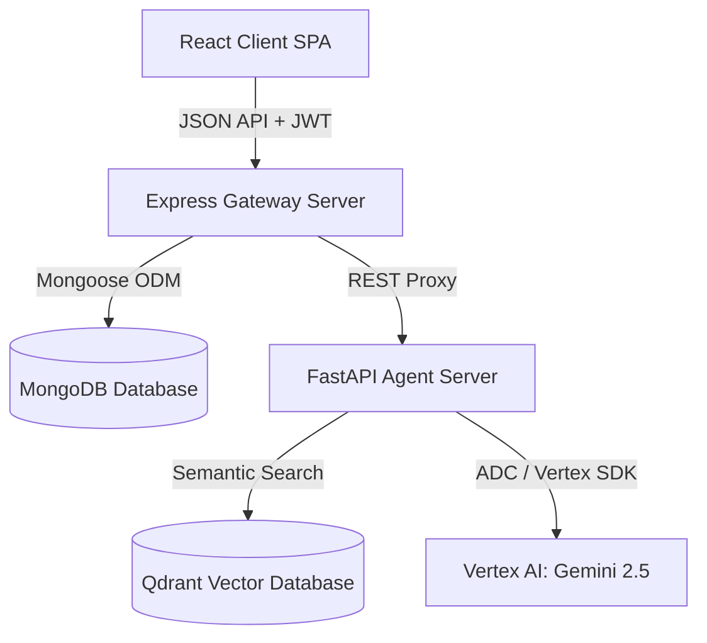
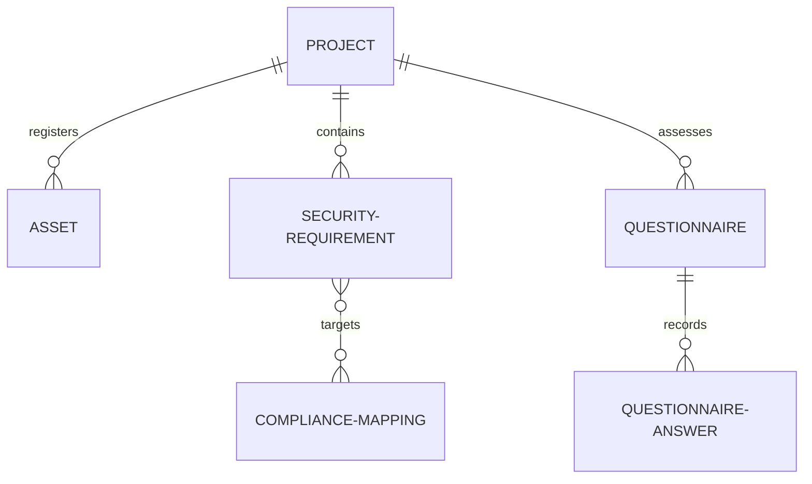
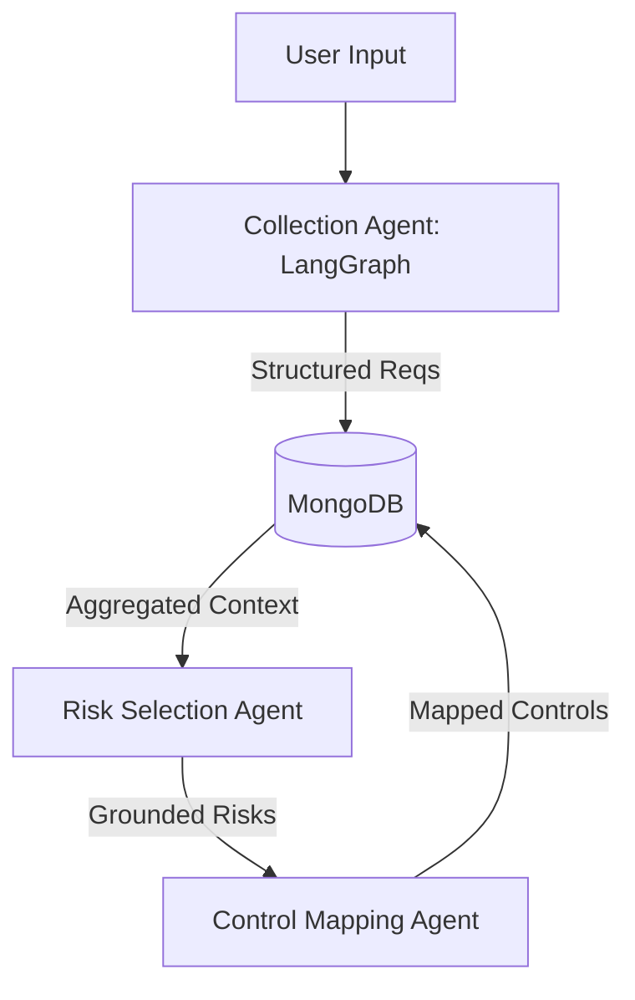
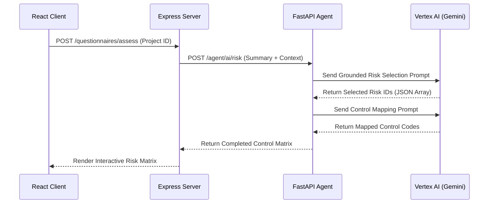
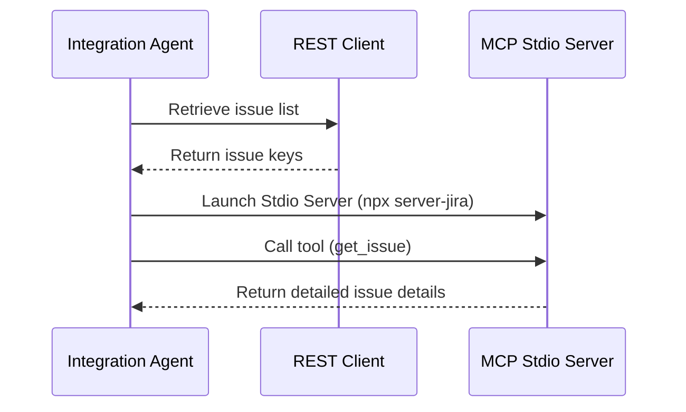

# 🛠️ Platform Rebuild & Architecture Specification

This document provides a comprehensive, build-ready engineering specification designed to enable an engineering team or autonomous agent to recreate, maintain, and scale the AI Governance and Cybersecurity Risk Platform.

---

## 📌 SECTION 1 — Executive Architecture Overview

### 1. System Context & boundaries
The platform manages AI and cybersecurity governance. It coordinates data relationships across:
* **Projects**: The core organizational boundary (e.g. `PRJ-AI-90`).
* **Assets**: AI models, datasets, or infrastructure mapped to a Project.
* **Requirements**: Technical, security, or compliance constraints mapped to an Asset.
* **Risks**: Potential hazards identified from system summaries.
* **Controls**: Standardized mitigations mapped to risks to ensure framework compliance.

### 2. High-Level Architecture
The system uses a 3-tier microservices architecture:
1. **Frontend (React + Vite)**: Standard SPA handling dashboards, matrices, and forms.
2. **Backend (Node.js + Express)**: Handles auth, database schemas, and routes.
3. **AI Agents (FastAPI + Python)**: Performs risk analysis, control mapping, RAG operations, and chat collection.



---

## 📌 SECTION 2 — Repository Analysis

### 1. Module Ownership Map
```
ai-governance-main/
├── backend/                  # Node.js Express Backend Service
│   ├── server.js             # Express Gateway Server Entry Point
│   ├── models/               # Mongoose Schema Definitions (SecurityRequirement, Questionnaire)
│   └── routes/               # API Routes & AI Proxy endpoints
│
└── backend/Agents/           # Python FastAPI AI Agent Service
    ├── main.py               # FastAPI Entry Point
    ├── agents/               # Core cognitive agent modules
    │   ├── collection_agent.py   # LangGraph guided chat & extraction router
    │   ├── risk_matrix_agent.py  # Excel-grounded Risk & Control mapping
    │   └── app.py            # Local RAG engine using Qdrant
    └── .env                  # Configuration variables
```

### 2. Key File Analysis

#### `backend/server.js`
* **Purpose**: Gateway server for the platform. Sets up Express, mounts routes, manages CORS, handles JWT authentication middleware, and establishes the MongoDB database connection.
* **Dependencies**: Express, Mongoose, JWT, CORS.

#### `backend/Agents/main.py`
* **Purpose**: Serves as the FastAPI entry point for the agent service. Exposes Excel-grounded endpoints for risk/control generation, and mounts routers for collection, RAG, and integration.
* **Dependencies**: FastAPI, uvicorn, pandas, openpyxl, pymongo.

#### `backend/Agents/agents/collection_agent.py`
* **Purpose**: Implements the guided conversational requirements intake flow. Builds and executes a LangGraph state machine to extract requirements and generate follow-up questions.
* **Dependencies**: LangGraph, Pydantic, pypdf.

---

## 📌 SECTION 3 — Data Model Reconstruction

The system uses MongoDB to persist user sessions, compliance questionnaires, project registries, and grounding libraries.

### 1. ER Diagram



### 2. Mongoose Schemas (Verified from Code)

#### Security Requirement Schema (`backend/models/SecurityRequirement.js`)
* **`id`**: String (Primary key, format: `REQ-YYYY-NNN`, required, unique).
* **`title`**: String (Required).
* **`description`**: String (Required).
* **`category`**: String (Enum: `Authentication`, `Access Control`, `Encryption`, etc.).
* **`priority`**: String (Enum: `Critical`, `High`, `Medium`, `Low`).
* **`status`**: String (Enum: `Draft`, `Approved`, `In Progress`, `Implemented`, `Rejected`).
* **`complianceMappings`**: Array of objects:
  * `framework`: String (e.g. `ISO 27001`).
  * `control`: String (e.g. `A.9.2.1`).
* **`projectId`**: String (Reference, index: true).
* **`owner`**: String.
* **`verification_method`**: String.
* **`acceptance_criteria`**: Array of strings.

---

## 📌 SECTION 4 — API Reconstruction

The system communicates internally via REST APIs using JSON payloads.

### 1. Requirements API Contract

#### `POST /requirements`
* **Authentication**: Bearer JWT token required.
* **Request Schema**:
  ```json
  {
    "id": "REQ-2026-001",
    "title": "Data Encryption at Rest",
    "description": "Encrypt all stored customer data using AES-256.",
    "category": "Encryption",
    "priority": "Critical",
    "status": "Draft",
    "projectId": "PRJ-90"
  }
  ```
* **Response Schema (201 Created)**:
  ```json
  {
    "success": true,
    "data": {
      "_id": "607f1f77bcf86cd799439011",
      "id": "REQ-2026-001",
      "title": "Data Encryption at Rest",
      ...
    }
  }
  ```

---

## 📌 SECTION 5 — Agent System Architecture



### 1. Collection Agent (`agents/collection_agent.py`)
* **Purpose**: Manages conversational requirements intake.
* **Workflow**: A LangGraph state machine containing an `extract` node (extracts JSON data) and a `respond` node (generates follow-up questions).
* **Prompt Rule**: Acts as a security consultant, asking one question at a time to complete requirements.

### 2. Risk Selection Agent (`agents/risk_matrix_agent.py`)
* **Purpose**: Identifies relevant system risks.
* **Workflow**: Loads the predefined risk framework, prompts Gemini with the project description, and parses the output into a markdown table.
* **Prompt Rule**: Constrains Gemini's output to valid risk IDs present in the spreadsheet library.

---

## 📌 SECTION 6 — Execution Lifecycle

Tracing a risk assessment request through the system:



---

## 📌 SECTION 7 — Memory Architecture

### 1. Transcript Memory
Used in chat collection. The conversation transcript is stored as an array of messages and passed in the API request body to maintain context between turns.

### 2. Semantic Search Memory (RAG Vector Store)
Used for document retrieval. Documents synced from GCS are split into 1000-character chunks with a 150-character overlap, vectorized using `models/text-embedding-004`, and stored in Qdrant.

---

## 📌 SECTION 8 — Tool Calling Architecture

The platform integrates with external systems using a hybrid REST/MCP architecture.



---

## 📌 SECTION 9 — Prompt Engineering System

All prompts are stored inside `agents/` and use a template-based injection strategy.

### Extraction Prompt Example
```python
EXTRACTION_PROMPT = """
You are a Cyber Security Requirement Extractor.
Analyze the following conversation and extract all security requirements.
For each requirement, provide:
- title: A short descriptive name
- description: A detailed explanation of the requirement
- category: One of [Authentication, Access Control, Encryption, ...]
- priority: One of [Critical, High, Medium, Low]

Return the response ONLY as a JSON list of objects.
"""
```

---

## 📌 SECTION 10 — Error Handling & Resilience

### API Failure Fallbacks
* **Gemini API Limit (429)**: The system catches quota errors and falls back to mock dataset matching [collection_agent.py:299-364](file:///c:/Users/Pranay%20Gupta/Pictures/AI-Goverance-Health/ai-governance-main/backend/Agents/agents/collection_agent.py#L299-L364).
* **JSON Parse Errors**: If output cleaning fails, the system falls back to default empty objects to prevent application crashes.

---

## 📌 SECTION 11 — Security Architecture

### Local Development Authentication
To avoid hardcoding sensitive credentials:
* **Vertex AI**: The application uses **Google Application Default Credentials (ADC)** via the local Google Cloud SDK (`gcloud auth application-default login`).
* **Express Gateway**: Backend routes are protected by JWT authentication middleware [server.js:109](file:///c:/Users/Pranay%20Gupta/Pictures/AI-Goverance-Health/INTEGRATION_COMPLETE.md#L109).

---

## 📌 SECTION 12 — Infrastructure & Deployment

### Local Development Setup
1. **Database**: Spin up MongoDB and Redis using Docker Compose:
   ```bash
   docker-compose -f docker-compose.dev.yml up -d
   ```
2. **Backend**: Start the Express server:
   ```bash
   npm run dev
   ```
3. **Agent Service**: Activate the virtual environment and start FastAPI:
   ```bash
   .\.venv\Scripts\python main.py
   ```

---

## 📌 SECTION 13 — Scalability Review

### Potential Bottlenecks & Scaling Strategies
* **Vector Search Limits**: Local Qdrant databases should be migrated to a dedicated cluster as document volume scales.
* **LLM Call Times**: Blocking operations are currently handled via worker threads using `asyncio.to_thread`. High-throughput production environments should implement asynchronous queues (e.g. Celery + Redis).

---

## 📌 SECTION 14 — Code Walkthrough

### Walkthrough: `risk_matrix_agent.py`

#### `generate_risk_matrix`
* **Purpose**: Compares project summaries to the predefined risk library.
* **Inputs**: `summary` (str).
* **Outputs**: Markdown table of selected risks.
* **Pseudocode**:
  ```python
  async def generate_risk_matrix(summary):
      system_prompt = build_system_prompt(PREDEFINED_RISKS_MARKDOWN)
      return await asyncio.to_thread(
          invoke_text,
          messages=[{"role": "system", "content": system_prompt}, {"role": "user", "content": summary}],
          temperature=0.5
      )
  ```

---

## 📌 SECTION 15 — Build Blueprint

### 1. Backend Structure
* **`models/`**: `SecurityRequirement.js`, `Questionnaire.js`, `ChatSession.js`.
* **`routes/`**: `requirements.js`, `questionnaire.js`, `trust_center.js`.

### 2. AI Services Structure
* **`agents/`**: `collection_agent.py`, `risk_matrix_agent.py`, `app.py`.
* **`services/`**: `integration_service.py`, `library_store.py`.

---

## 📌 SECTION 16 — Implementation Roadmap

### Phase 1: Core Backend & DB (Weeks 1-2)
* Setup Express server, JWT middleware, and MongoDB schemas.
* **Dependencies**: None.

### Phase 2: Agent Framework & RAG Service (Weeks 3-4)
* Implement FastAPI routers, LangGraph chat collection, and local Qdrant integration.
* **Dependencies**: Phase 1.

### Phase 3: Frontend Client (Weeks 5-6)
* Implement React dashboards, questionnaire forms, and risk matrix visualizations.
* **Dependencies**: Phase 2.

---

## 📌 SECTION 17 — Acceptance Criteria

### Verification Checklist
* [ ] Verify that `POST /requirements` validates inputs and saves to MongoDB.
* [ ] Confirm that `POST /agent/collect` extracts requirements and returns structured JSON.
* [ ] Test GCS syncing to verify Qdrant indexing and RAG query retrieval.

---

## 📌 SECTION 18 — Knowledge Transfer

### levels of Explanation

#### Product Manager Explanation
> The platform acts as a smart compliance checklist. It takes text summaries of AI systems, automatically highlights framework risks, and links them to required security controls to simplify auditing.

#### Architect Explanation
> The application uses a decoupled microservices design. An Express API gateway manages auth and MongoDB storage, while a FastAPI service handles the agentic AI logic, utilizing LangGraph for chat flows, Qdrant for semantic search, and Vertex AI for reasoning.

### Debugging Exercises
* **Scenario**: The RAG chatbot returns "I don't know" for all policy queries.
* **Steps**:
  1. Check the `.gcs_manifest.json` file to verify that documents were successfully synced.
  2. Verify that Qdrant is running and that the collection is not empty.
  3. Inspect the embedding config in `.env` to verify the correct model is active.
