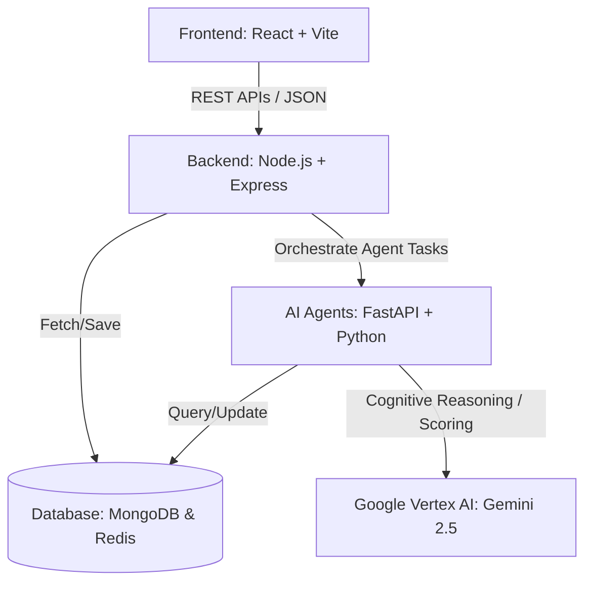
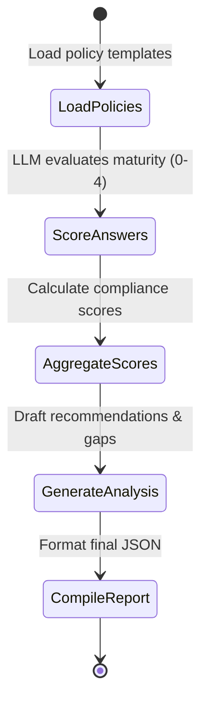
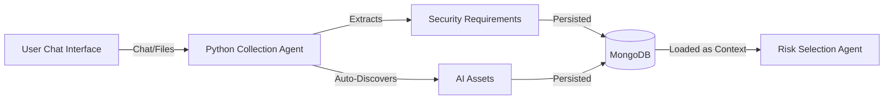
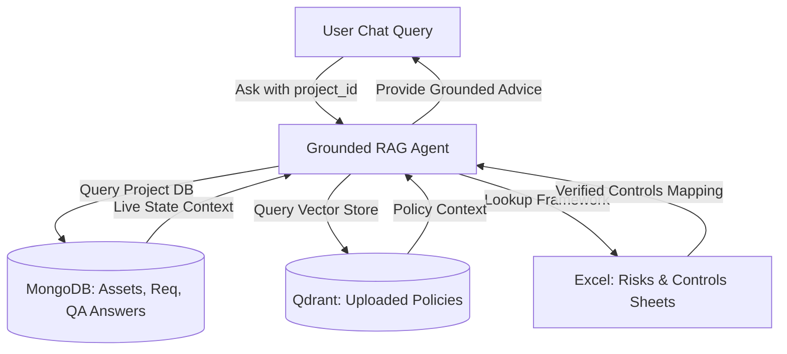

# 🚀 AI Governance & Cybersecurity Risk Platform: Architectural & Agentic AI Overview

This document provides a comprehensive, manager-ready explanation of the platform's architecture, data flows, and Agentic AI mechanisms.

---

## 📌 1. High-Level System Architecture

The platform is built on a modern **3-Tier microservices architecture**, dividing responsibilities clearly between user interface, data management, and artificial intelligence reasoning.



### 🔹 Tier 1: Frontend (React + Vite)
*   **Role:** The presentation layer. Renders a responsive, premium dashboard.
*   **Key Tasks:** Captures questionnaire responses, visualizes risk matrices, renders compliance score progress bars (EU AI Act, NIST, ISO), and manages user dashboards.

### 🔹 Tier 2: Backend (Node.js + Express)
*   **Role:** The data management and orchestration layer.
*   **Key Tasks:** Handles user authentication (JWT), maps data relationships (projects ➔ assets ➔ requirements ➔ risks ➔ controls), and orchestrates calls to the AI Agent service.

### 🔹 Tier 3: AI Agents (Python + FastAPI)
*   **Role:** The cognitive/reasoning layer.
*   **Key Tasks:** Performs intelligent matching, formats unstructured inputs, rates answers against policy standards, and interacts with Google Cloud's Vertex AI LLM models.

---

## 🤖 2. What is "Agentic AI" and How does it Work Here?

Traditional AI applications use **linear prompts** (e.g., "Summarize this text"). **Agentic AI** goes beyond this by modeling AI behavior as an **autonomous agent** that can make decisions, access databases, and follow multi-step reasoning workflows using **state machines**.

In this platform, the Python FastAPI server hosts three specialized AI agents:

### 1️⃣ The Risk Selection Agent
*   **Goal:** Read a project summary and select only the relevant risks from the master library of 60+ risks (avoiding generic lists or hallucinated risks).
*   **Logic:**
    1.  Fetches the master risks spreadsheet from MongoDB.
    2.  Feeds the list and the project summary into the Gemini model.
    3.  Instructs the LLM to act as a **risk assessor** and output a clean JSON array of matching Risk IDs.
    4.  Saves the identified risks to the project database.

### 2️⃣ The Control Mapping Agent
*   **Goal:** Map specific mitigation controls from a library of 46 controls to the identified risks.
*   **Logic:**
    1.  Receives the generated risks and the master controls library.
    2.  Prompts the LLM as a **security controls architect** to match each risk to corresponding control codes (e.g., matching *Data Poisoning* to `[DO-1] Data Sanitization`).
    3.  Persists the mappings in the database for tracking.

### 3️⃣ The Governance Assessor Agent (LangGraph State-Machine)
This is the most advanced agent, utilizing **LangGraph** (an agentic framework from LangChain that models workflows as cyclic/acyclic state graphs). 



*   **LoadPolicies Node:** Reads the core corporate AI policy documents.
*   **ScoreAnswers Node:** Iterates over each user questionnaire response. It calls Gemini, acts as an **auditor**, and grades the answer on a maturity scale of `0` (no evidence) to `4` (fully optimized) with a textual rationale.
*   **AggregateScores Node:** Computes framework compliance ratings (EU AI Act, NIST AI RMF, ISO 42001) by weighting the scores from the previous nodes.
*   **GenerateAnalysis Node:** Automatically drafts actionable recommendations for gaps (e.g., *"Focus on EU AI Act compliance: establish risk classification..."*).
*   **CompileReport Node:** Compiles the complete assessment JSON payload and returns it to the Node backend.

---

## 🔐 3. Google Vertex AI & Enterprise Security

To ensure enterprise-grade security, the platform integrates with **Google Cloud Vertex AI**:
*   **Model Used:** `gemini-2.5-flash` (fast, cost-effective reasoning).
*   **Authentication:** Utilizes **Google Application Default Credentials (ADC)**. This means it inherits the authenticated session of the system's local Google Cloud SDK (`gcloud auth application-default login`), preventing the need to hardcode sensitive API keys in source files or configuration files.

---

## 📈 4. Why this Architecture Wins (Benefits for Management)

1.  **Context-Aware Selection (No Hallucinations):** The agents constrain Gemini's context strictly to the predefined corporate Excel spreadsheets. The AI cannot invent fake risks or controls.
2.  **Decoupled microservices:** The Python AI agents can be updated, redeployed, or scaled independently of the main Node backend database server.
3.  **Auditability:** Every compliance score has a clear, model-generated rationale referencing corporate policies, giving human auditors full transparency.

---

## 🔗 5. Interactive Chat Agent: Context-Aware vs. Isolated?

A common question from leadership is: **"Is the chat tool working in a silo, or does it know about the rest of the application context?"**

The chat feature is **fully connected to the rest of the system** and actively drives the intake flow for requirements and assets:



### 🔹 Input Sourcing and Conversational Intake
The **Chat Agent** (`collection_agent.py`) acts as a guided intake consultant. It takes in the conversational messages history between the user and the assistant.
*   **Requirements Extraction:** As the user chats about their project (or uploads a security document / PDF / Excel), a LangGraph extractor node processes the conversation history and extracts structured requirements (title, description, category, priority).
*   **Asset Discovery:** After requirements are established, the chat agent exposes a `/discover-assets` endpoint. It parses the gathered requirements and automatically infers what AI components must exist (e.g., NLP Models, datasets, APIs, Speech AI) to fulfill them.

### 🔹 The Downstream Data Connection (How the Chat feeds the Risks)
The Chat is **not** isolated. Everything you build inside the Chat (and document uploads) flows directly into the core Risk Assessment:
1.  When you chat and save requirements, they are stored in **MongoDB** collections (`securityrequirements` and `assets`).
2.  When a user runs an AI Governance Risk Assessment, the Node.js backend retrieves **both the questionnaire answers** AND any manually added/chat-extracted **assets** and **requirements** associated with that project.
3.  These assets and requirements are serialized into a single comprehensive project description (`finalSummary`) [questionnaire.js:204](file:///c:/Users/Pranay%20Gupta/Pictures/AI-Goverance-Health/ai-governance-main/backend/routes/questionnaire.js#L204):
    ```js
    const finalSummary = `${summary}\n${assetsContext}\n${reqsContext}`;
    ```
4.  This combined context is what gets sent directly to the **Risk Agent** [questionnaire.js:231-235](file:///c:/Users/Pranay%20Gupta/Pictures/AI-Goverance-Health/ai-governance-main/backend/routes/questionnaire.js#L231-L235).
5.  Therefore, **adding manual requirements/assets directly impacts the risks selected by the risk agent.**

---

## 🗃️ 6. Grounding on Excel Datasets (No Hallucinations)

To guarantee compliance safety and avoid AI hallucinations, all agent outputs are **grounded strictly on verified datasets**:

| Agent Component | Predefined Grounding Dataset | How Grounding is Enforced |
| :--- | :--- | :--- |
| **Risk Selection Agent** | `AI_Cybersecurity_Governance_Framework.xlsx` (AI Risks sheet) | The agent reads the spreadsheet rows using pandas (`read_ai_risks`). It passes this exact list of risks to Vertex AI, prompting the LLM to choose *only* the matching IDs from this dataset. |
| **Control Mapping Agent** | `AI_Cybersecurity_Governance_Framework.xlsx` (AI Controls sheet) | Rather than letting Gemini make up mitigations, the agent provides the list of 46 standard controls from the sheet. The LLM acts only as a mapping matrix, matching identified risks to actual control codes (e.g., `DO-1`, `PT-2`). |
| **Governance Assessor Agent**| Corporate AI Policy Templates | The LangGraph state-machine feeds in corporate policy mandates (e.g., EU AI Act, NIST AI RMF, ISO 42001) as the reference context. User answers are rated strictly against these directives. |
| **RAG (Retrieval-Augmented Generation) Chat** | Uploaded Corporate Documents & Policies | When using the general QA/RAG chat, the system embeds uploaded PDFs/documents into Qdrant. The LLM is strictly instructed: *"Use ONLY the provided context. If the answer isn't in the context, say you don't know."* |

---

## 📊 7. Summary of End-to-End Data Pipeline

Here is the exact step-by-step route data takes through the backend:

1.  **Intake Phase (Chat / Upload):**
    *   User talks to the chat client or uploads policies.
    *   **Chat Agent** outputs structured Requirements and Assets.
    *   Node backend stores them under the project ID in MongoDB.
2.  **Risk Generation Phase:**
    *   User hits "Assess/Generate Risks".
    *   Node backend aggregates the questionnaire answers + assets + requirements into a detailed project prompt payload.
    *   **Risk Agent** queries the Excel library and selects matching Risk IDs.
3.  **Control Selection Phase:**
    *   Node backend forwards the generated risks to the **Controls Agent**.
    *   **Controls Agent** maps the risks to standard Excel-defined Controls.
4.  **Governance Assessment Phase:**
    *   User submits the final compliance questionnaire.
    *   **LangGraph Governance Agent** compares responses to policy documents and calculates a maturity score (0-4) for each control, aggregating them into NIST, ISO, and EU framework percentage scores.
5.  **Persistence & Visualization:**
    *   Node backend saves final ratings and recommendations to MongoDB.
    *   React frontend renders compliance scores, risk matrices, and action items.

---

## 🔮 8. Planned Upgrades: Context-Aware Grounded RAG Chat

To move past one-way data integration, the next version of the platform includes a **fully context-aware RAG Chat Agent**. This upgrade closes the loop by allowing the RAG chatbot to retrieve live project details from the database and ground its advice in corporate frameworks:



### 🔹 Key Capabilities
*   **Project-Specific Memory:** By passing `project_id` in the API payload, the chat agent reads the project's questionnaire answers, manual requirements, and asset inventory. It knows exactly what you are building.
*   **Bidirectional Context Flow:** The user can ask: *"What assets did we inventory for this project?"* or *"What was our maturity score for audit logging?"* and the chatbot will query the database to answer.
*   **Framework-Grounded Recommendations:** When asked about mitigations, the chat agent matches the project's live risks directly to actual codes (`DO-1`, `PT-2`) in the predefined Excel spreadsheets, ensuring advice remains fully aligned with the corporate compliance framework.


